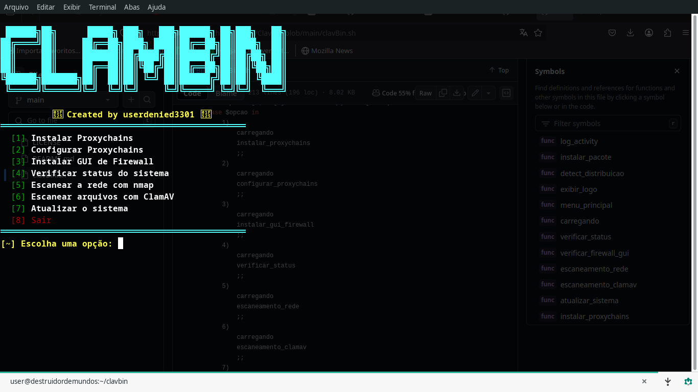

# ClavBin


## Firewalll Bash Tool


**ClavBin** é uma ferramenta de segurança e automação de terminal desenvolvida em **Bash**. Ela combina funcionalidades de firewall e assistente de funções, permitindo que os usuários realizem tarefas de segurança, monitoramento de rede e automação diretamente pelo terminal, de maneira eficiente e sem a necessidade de interfaces gráficas. Além disso, oferece um controle granular sobre as conexões de rede e facilita a configuração de proxies para anonimato.





## Funcionalidades

- **Firewall em Terminal**: Controla o tráfego de rede no sistema, permitindo ou bloqueando pacotes com base em regras de filtragem configuráveis. O firewall é gerido diretamente via terminal, oferecendo flexibilidade e alto desempenho.
  
- **Assistente de Funções**: Oferece uma série de funções de automação para facilitar a administração do sistema, como verificações de segurança, monitoramento de tráfego de rede e ajustes rápidos em configurações de rede.

- **Escaneamento Antivírus (Integrado com ClamAV)**: Realiza varreduras no sistema em busca de malwares e vírus, utilizando o motor **ClamAV** para garantir que o ambiente esteja livre de ameaças.

- **Integração com Proxychains**: Permite que o tráfego de rede seja roteado através de uma cadeia de proxies configuráveis, garantindo anonimato e maior segurança durante a navegação.

## Instalação

### Pré-requisitos

- **ClamAV**: A ferramenta utiliza **ClamAV** para escaneamento de vírus e malwares. Certifique-se de tê-lo instalado antes de executar ClavBin.
  
- **Dependências de Sistema**:
  - `iptables` (para configuração do firewall)
  - `Proxychains` (se desejar usar a funcionalidade de proxy)

### Passos para Instalação

1. **Clone o repositório**:

   Clone o repositório do GitHub para o seu sistema:
   ```bash
   git clone https://github.com/seu-usuario/clavbin.git
   cd ClavBin
   ls
   chmod +x ClavBin.sh
   ./ClavBin.sh

   ````

  # Contribuindo para clavBin

Obrigado por considerar contribuir para o **clavBin**! Este guia fornece diretrizes para garantir que sua contribuição seja integrada de maneira eficiente e alinhada com os padrões do projeto.

##  Como Contribuir para o projeto

### Fork e Clone o Repositório

1. Faça um fork deste repositório para sua conta no GitHub.
2. Clone o repositório forkado para sua máquina:
   ```bash
   git clone https://github.com/seu-usuario/clavBin.git
   ```
3. Navegue até o diretório do projeto:
   ```bash
   cd clavBin
   ```

### 2️⃣ Criando uma Branch

Sempre trabalhe em uma branch separada para sua feature ou correção:
```bash
git checkout -b minha-feature
```

### 3️⃣ Implementando Alterações

- Mantenha seu código modular e bem documentado.
- Siga os padrões do projeto para estrutura e estilo.
- Teste suas alterações antes de enviar.

### 4️⃣ Commitando Mudanças

- Utilize mensagens de commit descritivas e padronizadas:
  ```bash
  git commit -m "feat: adiciona suporte a configuração automática de firewall"
  ```
- Seguem alguns prefixos úteis para commits:
  - `feat:` → Nova funcionalidade
  - `fix:` → Correção de bug
  - `docs:` → Atualização de documentação
  - `refactor:` → Melhorias de código sem alterar funcionalidade
  - `test:` → Adição ou atualização de testes

### 5️⃣ Enviando um Pull Request (PR)

1. Suba suas alterações para o repositório remoto:
   ```bash
   git push origin minha-feature
   ```
2. Acesse o repositório original no GitHub e crie um Pull Request.
3. Aguarde a revisão e esteja pronto para fazer ajustes, se necessário.

##  Diretrizes de Código

- **Legibilidade:** Código bem estruturado e comentado.
- **Segurança:** Evite hardcoding de credenciais e siga boas práticas.
- **Desempenho:** Busque eficiência e evite repetições desnecessárias.

##  Sugestões de Contribuição

- Melhorias no sistema de segurança e firewall.
- Implementação de novos módulos de análise.
- Otimização do código para maior eficiência.
- Criação de testes automatizados.

##  Contato

Caso tenha dúvidas, abra uma *issue* ou entre em contato pelo GitHub!

Vamos juntos tornar o **clavBin** ainda mais robusto! 

